Hasteko datu basearen diseinua egin dugu. MongoDb-tik hartutako datuekin, MariaDB-n datu base bat sortu dugu, datuak laburtuz.
.png)
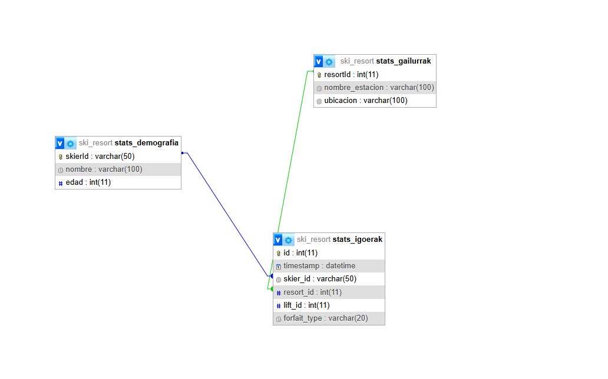

Ondoren, VSCode-n bi javascript sortu ditugu Hau da lehen javascript-eko azalpena.
1. Fasea: Erauzketa eta Transformazioa (MongoDB Aggregations)
Script-ak ez ditu datuak banan-banan kopiatzen; MongoDB-ren ahalmen estatistikoa erabiltzen du informazioa laburtzeko aggregate funtzioaren bidez:

igoerak agregazioa: $group operadorearen bidez, eski-estazio bakoitzeko (resortId) eta igogailu bakoitzeko (liftId) igoera guztiak batzen ditu. Emaitza ez da "nork igo duen", baizik eta "zenbat bider erabili den igogailu hori".

demografia agregazioa: Forfait motaren (forfaitType) arabera banatzen ditu datuak. Horri esker, estazio bakoitzak badaki bere bezeroek denboraldiko txartela, egunekoa edo bestelakoren bat erabili duten.

gailurrak agregazioa: Denbora-analisia egiten du $hour erabiliz. Honek estazioko "ordu gorenak" (peak hours) identifikatzeko balio du, ordu bakoitzeko igoera kopurua kalkulatuz.

2. Fasea: MariaDB-ren Prestaketa (Garbitasuna)
Datu berriak sartu aurretik, script-ak TRUNCATE TABLE aginduak exekutatzen ditu.

Zergatik? Datu zaharkituak ezabatzeko eta informazioa ez bikoizteko.

Garrantzitsuak diren mugak: MariaDB-n Foreign Key-ak aktibatuta badituzu, TRUNCATE aginduak errorea emango du (Error 1701). Horregatik, script-aren bertsio aurreratuetan SET FOREIGN_KEY_CHECKS = 0 erabili behar da garbiketa hau egin ahal izateko.

3. Fasea: Karga (SQL Inserzioak)
Azken urratsa MongoDB-n lortutako array-ak (emaitzak) MariaDB-ra pasatzea da for begizten bidez:

Datu bakoitza bere taula espezifikoan sartzen da: stats_igoerak, stats_demografia edo stats_gailurrak.

Hemen funtsezkoa da Foreign Key egitura: resort_id edo skier_id bezalako eremuek bat etorri behar dute lehenago sortutako taula gurasoekin, bestela MariaDB-k Error 150 emango luke.

.png)

Eta hau da bigarren javascript-eko azalpena:
Behin datuak MariaDB-n (SQL) garbi eta antolatuta dituzunean, script honen lana informazio hori JSON fitxategi batean esportatzea da, beste aplikazio batzuek (webgune batek edo dashboard batek, adibidez) erabili ahal izateko.

Hona hemen atalez atal egiten duena:

1. Datu-baserako konexioa
Script-a lehenago sortu duzun ski_resort MariaDB datu-basera konektatzen da.

Zerbitzaria: 127.0.0.1 (lokala).

Erabiltzailea: root.

2. Informazioa biltzea (SELECT)
Script-ak MariaDB-ko hiru estatistika-taulak irakurtzen ditu SQL kontsulten bidez:

Metadatuak: Azken eguneratze-data lortzen du, jakiteko datuak noizkoak diren.

Estatistika garbiak: stats_igoerak, stats_demografia eta stats_gailurrak tauletako datu guztiak hartzen ditu.

3. JSON fitxategia sortzea
Behin datuak lortuta, objektu bakar batean egituratzen ditu (finalData) eta resultado_final.json izeneko fitxategi batean gordetzen ditu zure ordenagailuan.

Fitxategi honek metadatuak (iturria eta data) eta hiru estatistika multzoak (igoerak, demografia eta erabilera) ditu.

4. Automatizazioa (setInterval)
Hau da zatirik interesgarriena: script-a ez da behin bakarrik exekutatzen eta kitto. Kodearen amaieran ikusten denez, 5 minuturo (300.000 ms) exekutatzen da automatikoki.

Horrela, JSON fitxategia beti eguneratuta egongo da, eskuz ezer egin beharrik gabe.

.png)
.png)
Hauek dira MariaDB-n sortutako query-ak eta haien azalpenak:
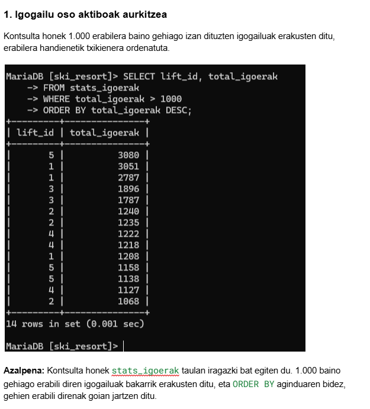
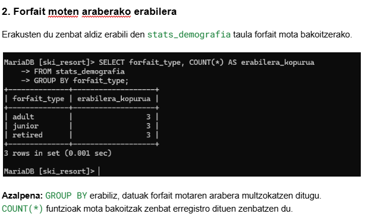
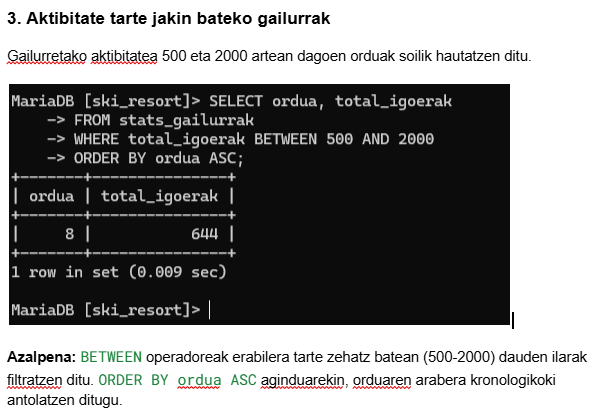
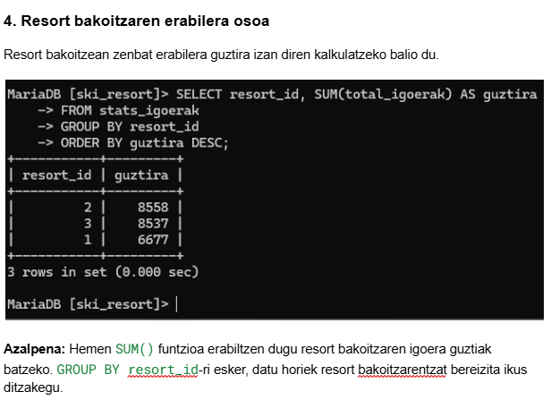

Eta hauek dira MongoDB-n sortutako kontsultak eta haien azalpenak:

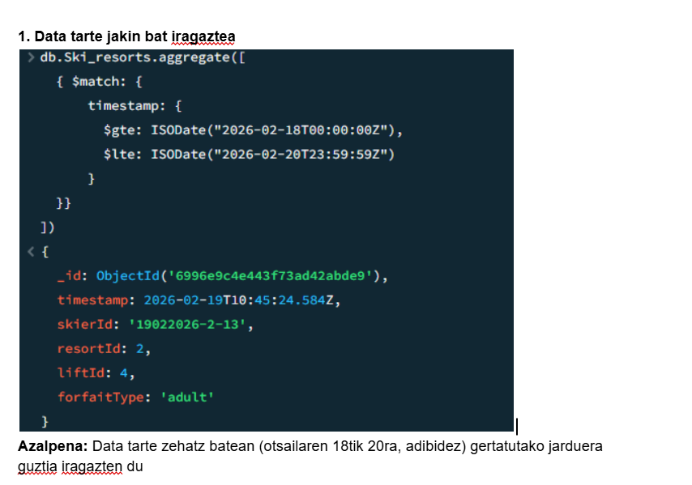
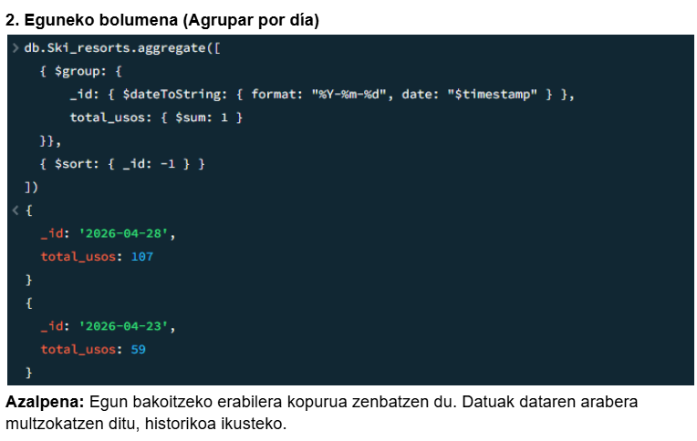
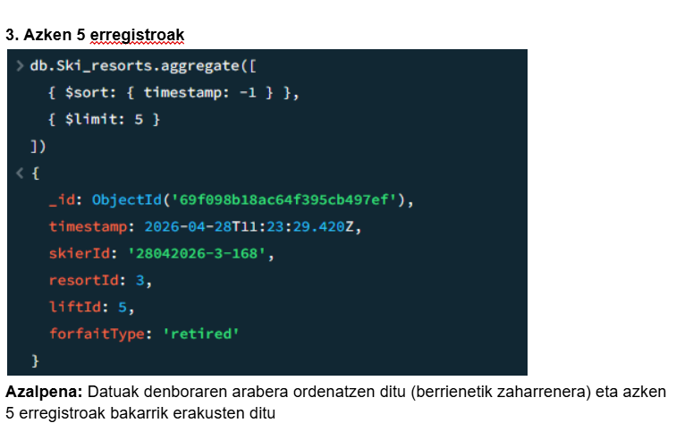
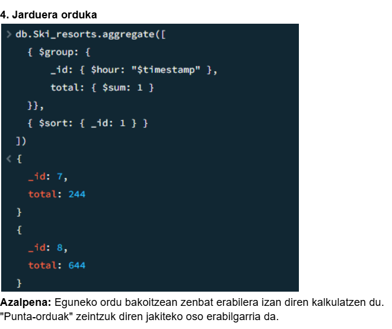
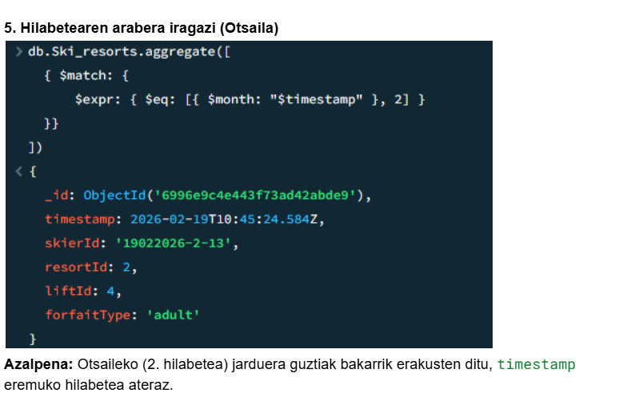
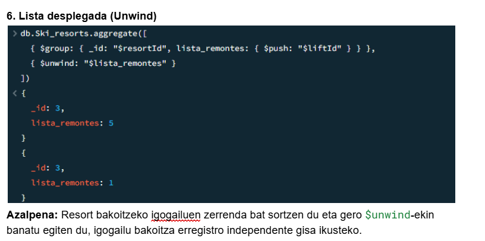
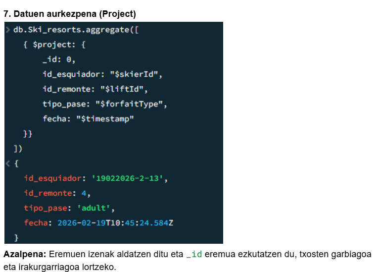
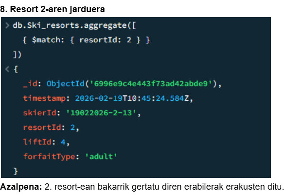
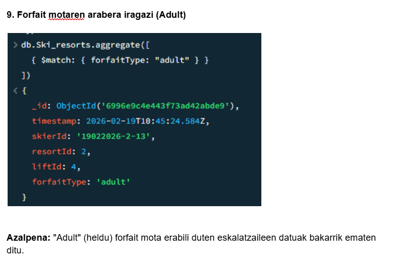
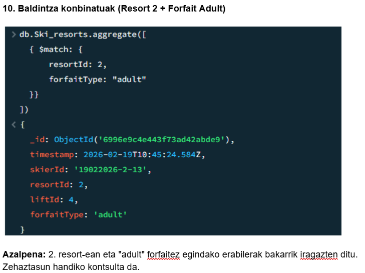
